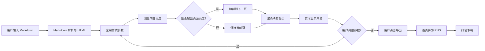

## 1. 产品概述

MD2Post 是一款面向内容创作者的 Markdown 转小红书图文工具，将左侧编辑的 Markdown 内容实时渲染为可分页的竖版图片，支持自定义尺寸、边距、字体、间距等参数，方便快速生成小红书风格的图文素材。
- 主要目的：解决小红书图文排版繁琐的问题，让创作者用 Markdown 即写即得图片
- 目标用户：小红书博主、公众号作者、知识整理者
- 市场价值：降低图文内容制作门槛，提升发布效率

## 2. 核心功能

### 2.1 用户角色
| 角色 | 使用方式 | 核心权限 |
|------|----------|----------|
| 创作者 | 直接打开网页 | 编辑 Markdown、调整样式、导出图片 |

### 2.2 功能模块
1. **编辑预览页**：Markdown 编辑器、实时图片预览、样式设置面板、导出按钮

### 2.3 页面详情
| 页面名称 | 模块名称 | 功能描述 |
|----------|----------|----------|
| 编辑预览页 | Markdown 编辑器 | 左侧输入 Markdown，支持语法高亮，自动保存到本地 |
| 编辑预览页 | 实时图片预览 | 右侧实时显示渲染后的分页图片，编辑后立即更新 |
| 编辑预览页 | 样式设置面板 | 可选图片尺寸(3:4 / 3:5)、边距、段落间距、行距、字体大小 |
| 编辑预览页 | 图片导出 | 一键导出当前所有分页为 PNG 图片（打包下载） |
| 编辑预览页 | 分页导航 | 显示总页数，可切换查看不同页面 |

## 3. 核心流程

用户在左侧编辑器输入 Markdown 文本 → 解析器将 Markdown 转为带样式的 HTML → 渲染引擎测量内容高度并按选定页面尺寸分页 → 右侧预览区实时显示分页图片 → 用户调整样式参数后立即重新分页渲染 → 用户点击导出按钮将所有页面转为 PNG 下载。

## 4. 用户界面设计

### 4.1 设计风格
- 主色调：温暖的米白底色 (#FAF7F2) + 墨黑文字 (#1A1A1A) + 珊瑚红强调色 (#FF4D4F)
- 次要色：浅灰边框 (#E8E4DC)、柔和的卡片背景 (#FFFFFF)
- 按钮风格：圆角 8px、扁平化、强调色按钮带轻微阴影
- 字体：标题用 "Noto Serif SC"（思源宋体），正文用 "Noto Sans SC"（思源黑体），编辑器用等宽 "JetBrains Mono"
- 布局风格：三栏布局 — 左侧编辑器、中间预览、右侧设置面板
- 图标风格：线性简洁图标（内联 SVG）

### 4.2 页面设计概述
| 页面名称 | 模块名称 | UI 元素 |
|----------|----------|----------|
| 编辑预览页 | 顶部工具栏 | Logo、导出按钮、分页指示器 |
| 编辑预览页 | 左侧编辑器 | 等宽字体、行号、语法高亮、可滚动 |
| 编辑预览页 | 中间预览区 | 居中显示分页图片、页面间分隔、可滚动 |
| 编辑预览页 | 右侧设置面板 | 尺寸选择、边距滑块、字体大小、行距、段落间距 |
| 编辑预览页 | 引用样式 | 左侧竖线 + 浅灰背景 + 斜体 |
| 编辑预览页 | 高亮样式 | 黄色背景标记 |
| 编辑预览页 | 下划线样式 | 文字下方下划线 |
| 编辑预览页 | 一级标题 | 大号宋体 + 底部边线 |
| 编辑预览页 | 二级标题 | 中号宋体 + 左侧色块 |

### 4.3 响应式
- 桌面优先设计，最小宽度 1024px 三栏布局
- 窄屏下设置面板可折叠为抽屉
- 触摸设备支持双指缩放预览区
