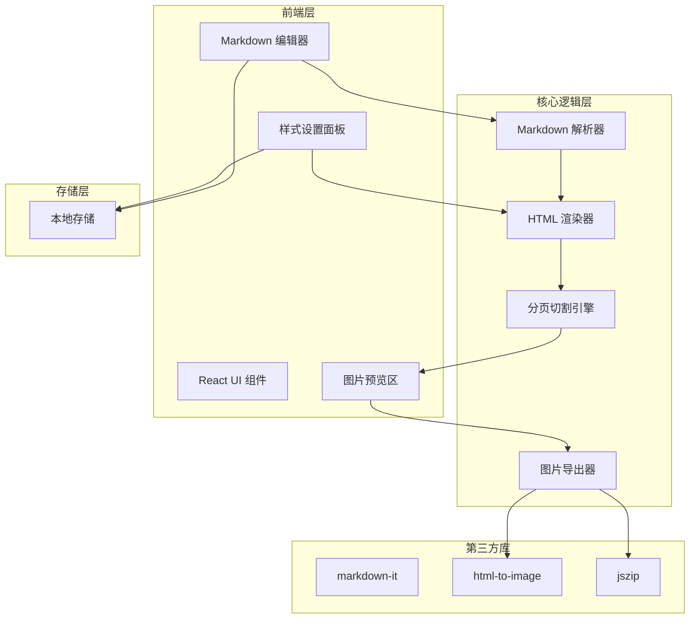
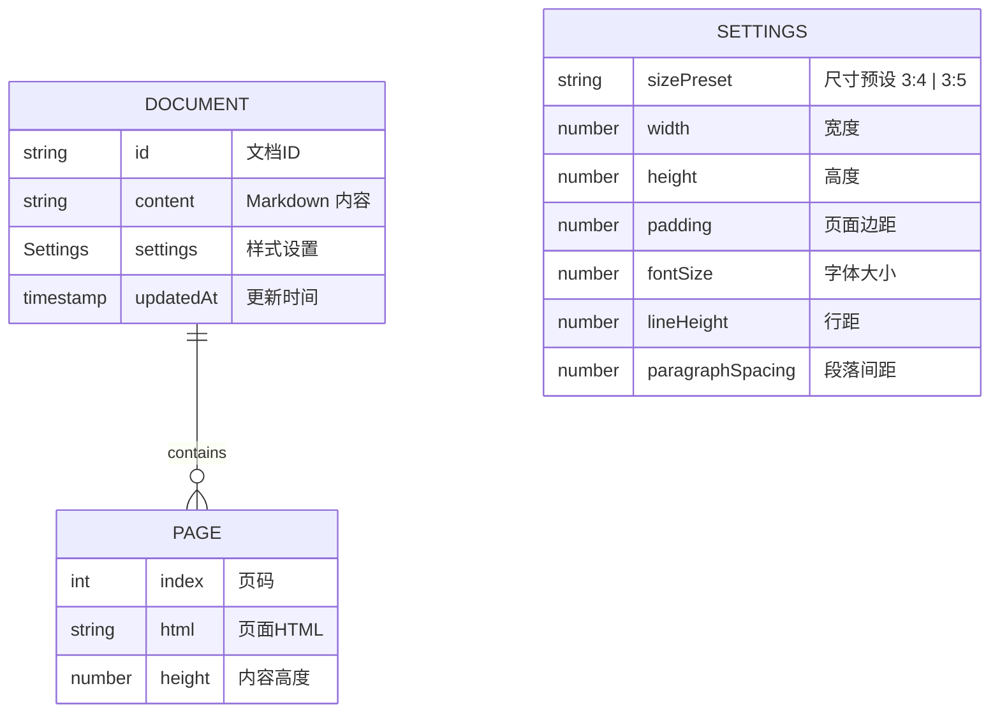

## 1. 架构设计



## 2. 技术说明
- 前端：React@18 + tailwindcss@3 + vite
- 初始化工具：vite-init (react-ts 模板)
- 后端：无（纯前端应用）
- 数据库：无（使用浏览器 LocalStorage 保存内容和设置）
- Markdown 解析：markdown-it（支持高亮 mark、下划线 u 等扩展）
- 图片导出：html-to-image（将 DOM 节点转为 PNG）
- 打包下载：jszip + file-saver

## 3. 路由定义
| 路由 | 用途 |
|------|------|
| / | 编辑预览页（单页应用，所有功能在一页内） |

## 4. API 定义
无后端 API，纯前端应用。

## 5. 服务端架构
无服务端。

## 6. 数据模型

### 6.1 数据模型定义


### 6.2 数据定义语言
无需数据库 DDL，使用 TypeScript 类型定义：

```typescript
interface Settings {
  sizePreset: '3:4' | '3:5';
  width: number;        // 默认 440
  height: number;       // 586 (3:4) 或 733 (3:5)
  padding: number;      // 默认 30
  fontSize: number;     // 默认 16
  lineHeight: number;   // 默认 1.6
  paragraphSpacing: number; // 默认 12
}

interface Document {
  content: string;
  settings: Settings;
  updatedAt: number;
}

interface Page {
  index: number;
  html: string;
  height: number;
}
```

## 7. 关键实现说明

### 7.1 实时预览
使用 React state + debounce，编辑器内容变化后 300ms 触发重新渲染。Markdown 解析为 HTML 后插入到隐藏的测量容器中，计算每个块元素的高度。

### 7.2 分页切割算法
1. 将 Markdown 解析为块级元素数组（段落、标题、引用、列表等）
2. 逐个累加块元素高度
3. 当累加高度 + 当前块高度 > 页面可用高度时，在当前块前切割
4. 对于单个块超过一页高度的极端情况，在块内部按行切割
5. 每页生成独立的 HTML 容器

### 7.3 图片导出
对每个页面 DOM 节点调用 html-to-image 的 toPng 方法，收集所有 PNG dataURL 后用 jszip 打包，通过 file-saver 下载。
